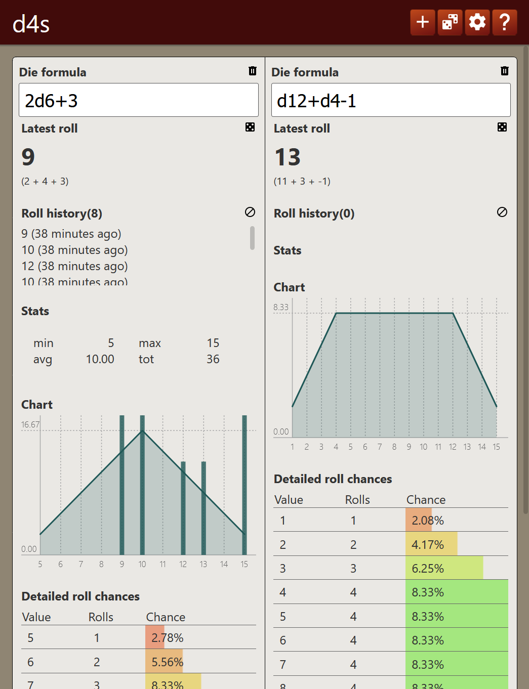

# d4s
> D&D Dice Distribution Statistics

### What is it?

It's a webapp that displays statistics for various dice configuration roll values

### Who is it for?

It was created for live RPG players (D&D), can be used in place of dice and the statistics give useful insights to players.

### But, why?

Because people look at 2d6 and d12, thinking those are roughly the same. This app can show the statistical differences between several die configurations.

*Also I just wanted to create something in Svelte, and this seemed like a good and easy project.*

### What does it look like?

Here's a screenshot:

I'm not really a designer so, this might not be the most pleasent thing to look at. If anyone wants to contribute with design mock, they're welcome.
